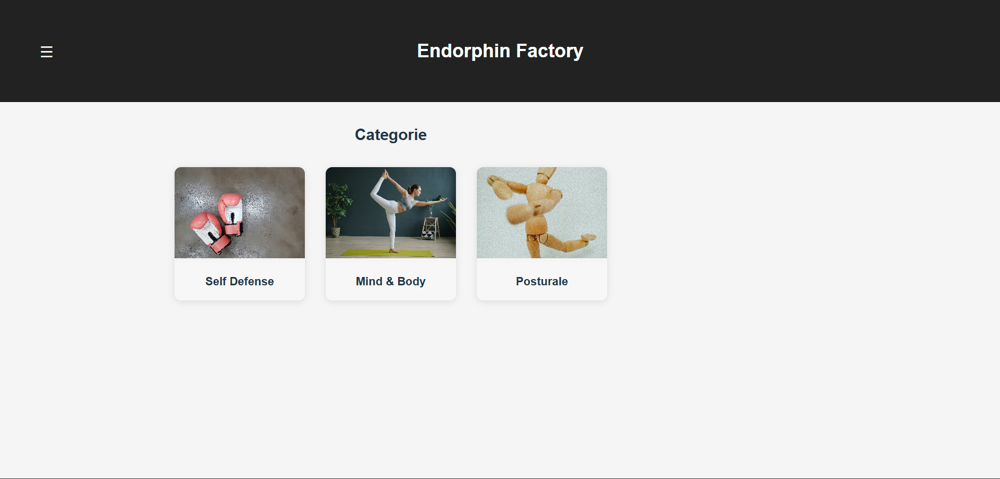
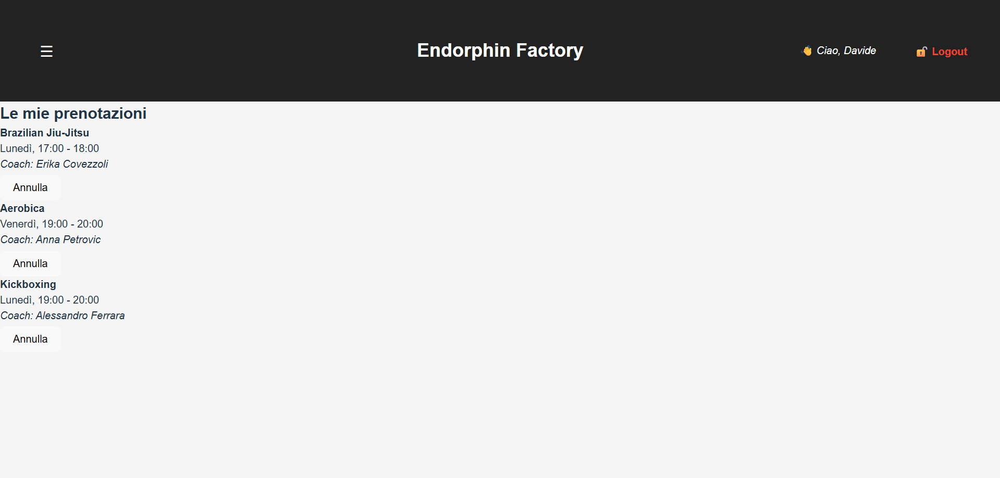

# Gym 1.0

Gym 1.0 è una piattaforma web per la gestione completa dei corsi fitness.  
Permette agli utenti di esplorare i corsi disponibili, registrarsi, prenotare sessioni e gestire il proprio profilo in maniera semplice e intuitiva.

---

## Funzionalità principali

### Utente
- Visualizzazione dei corsi disponibili con informazioni su coach, descrizione e orari
- Registrazione e login
- Prenotazione di sessioni e gestione del proprio profilo
- Possibilità di annullare le prenotazioni già effettuate

### Admin
- Accesso protetto tramite login
- Possibilità di gestire corsi e utenti (lato admin in sviluppo)
- Storico delle operazioni e gestione delle prenotazioni

---

## Tecnologie utilizzate

### Back-end
- Java
- Spring Boot
- MySQL
- IntelliJ IDEA

### Front-end
- JavaScript
- React (JSX)
- HTML
- CSS
- VS Code

---

### Home

### Categorie corsi

### Login

### Visualizzazione corsi + prenotazione

### Profilo utente + annulla corso

---

## Avvio del progetto

### Back-end

1. Clonare il repository: git clone https://github.com/Davide91-code/Gym-1.0.git

2. Configurare il database MySQL

3. Creare il file `application.properties` usando come riferimento `application.properties.example`

4. Avviare il progetto con: `mvn spring-boot:run`

### Front-end

1. Entrare nella cartella frontend

2. Installare le dipendenze: `npm install`

3. Avviare il progetto: `npm start`

4. Accedere al portale tramite browser

